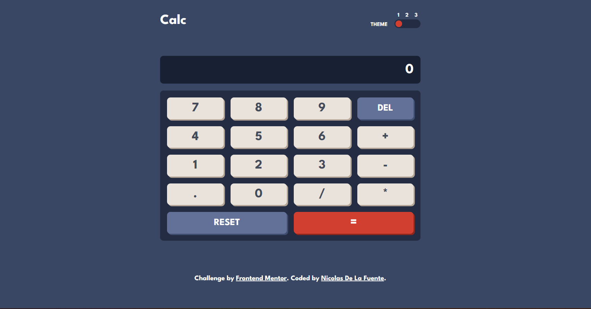

# Frontend Mentor - Calculator app solution

This is a solution to the [Calculator app challenge on Frontend Mentor](https://www.frontendmentor.io/challenges/calculator-app-9lteq5N29). Frontend Mentor challenges help you improve your coding skills by building realistic projects. 

## Table of contents

- [Overview](#overview)
  - [The challenge](#the-challenge)
  - [Screenshot](#screenshot)
  - [Links](#links)
- [My process](#my-process)
  - [Built with](#built-with)
  - [What I learned](#what-i-learned)
  - [Continued development](#continued-development)
- [Author](#author)

**Note: Delete this note and update the table of contents based on what sections you keep.**

## Overview

### The challenge

Users should be able to:

- See the size of the elements adjust based on their device's screen size
- Perform mathmatical operations like addition, subtraction, multiplication, and division
- Adjust the color theme based on their preference
- **Bonus**: Have their initial theme preference checked using `prefers-color-scheme` and have any additional changes saved in the browser

### Screenshot

### Links

- Solution URL: [GitHub](https://github.com/NicoDeLaFuente/calculator/settings/pages)
- Live Site URL: [Live Site](https://nicodelafuente.github.io/calculator/)

## My process

### Built with

- Semantic HTML5 markup
- Flexbox
- CSS Grid
- Mobile-first workflow
- Vainilla JavaScript

### What I learned

This was a great challenge to recap Vainilla Javascript. I haven´t written it in a while and it was really fun to do it. Help me to practice the logic and DOM manipulation. 

### Continued development

I am currently learning Next JS and I plan to lear Tailwind CSS really soon. Also, in June 2023 I will start my BackEnd Course so I will become a Full Stack Web Developer. That is my final goal since I get interested in this area. 

## Author

- GitHub - [@NicoDeLaFuente](https://github.com/NicoDeLaFuente)
- Frontend Mentor - [@NicoDeLaFuente](https://www.frontendmentor.io/profile/NicoDeLaFuente)
